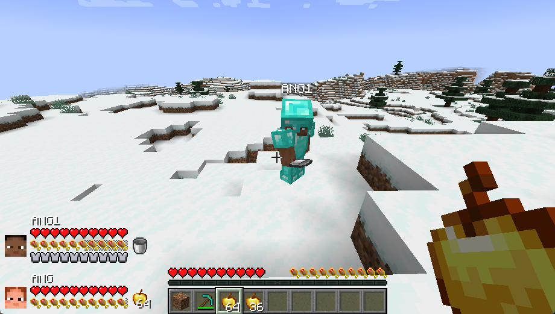
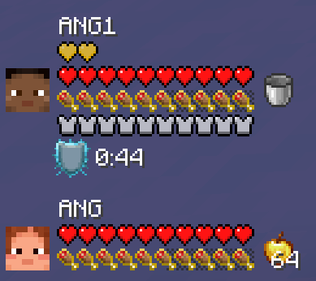
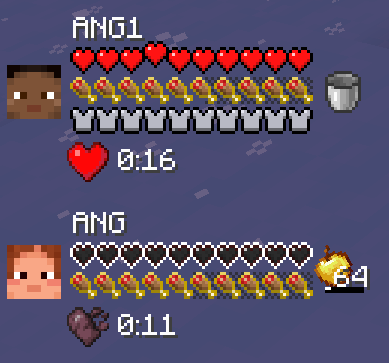
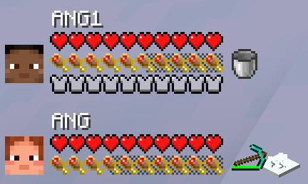
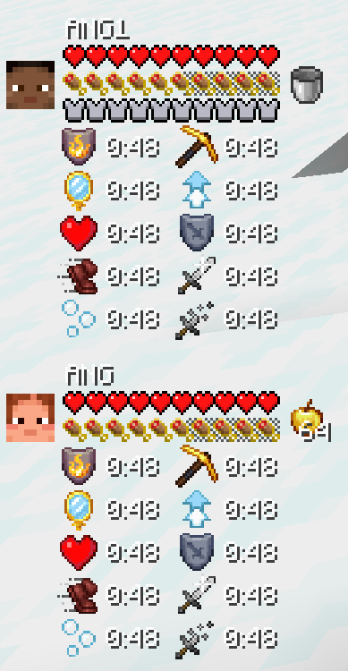

# TeamStatus

**See your teammates' vitals at a glance — health, hunger, armor, effects, held items and live actions, on a single compact HUD. Works at any distance and across dimensions.**

**在紧凑的 HUD 上一览队友状态——生命、饥饿、护甲、状态效果、手持物品与实时动作。不受距离与维度限制。**


***

## Features / 功能

### Team status HUD / 队伍状态 HUD

- Every online player gets a panel: player face, name, health hearts, hunger drumsticks, armor bar, active status effects (with remaining durations) and the main-hand item.
- No party/team framework is required — all online players are shown by default. The HUD works in singleplayer, on dedicated servers and across dimensions.
- Hearts/Food's animation reproduce vanilla behavior exactly: half hearts, absorption rows above the health bar, poison / wither / frozen heart types, hardcore textures, damage & heal blinking, and the low-health shake.
- Dead players' names turn red; name text is automatically trimmed when too long.
- 每位在线玩家都有一个面板：玩家头像、名称、生命爱心、饥饿鸡腿、护甲条、当前状态效果（含剩余时间）以及主手物品。
- 无需任何队伍 / 组队框架——默认显示所有在线玩家。单人游戏、专用服务器、跨维度均可使用。
- 红心/饥饿值动画完全还原原版：半颗心、生命值上方的伤害吸收行、中毒 / 凋零 / 冰冻爱心样式、极限模式材质、受伤与治疗闪烁，以及低血量抖动。
- 死亡玩家的名称变为红色；名称过长时自动截断。
  
  

### Live action animations / 实时动作动画

- **Mining** — a true 3D isometric block is rendered with the vanilla destroy crack overlay (all 10 stages projected onto every face). The held tool chops at the vanilla arm rate, automatically speeding up with Haste and slowing down with Mining Fatigue. Debris chips fly as cracks advance, and a debris burst plays when the block breaks.
- **Attacking** — a one-shot strike swing plays the moment a teammate lands a hit. The victim appears as a player face or the mob's real head model (with a spawn-egg fallback), covered by a red hit flash.
- **Eating / drinking** — a use-progress bar is drawn under the item, together with the chew bob, the "raise to mouth" tilt and food-crumb / drink-droplet particles.
- **挖掘**——以真实 3D 等距方块呈现目标，覆盖原版破坏裂纹（全部 10 个阶段，投影到方块每一面）。手持工具按原版手臂节奏挥动，急迫加速、挖掘疲劳减速。裂纹加深时飞出碎屑，方块破碎时播放碎屑迸发。
- **攻击**——队友命中瞬间播放一次性挥击动作。目标显示为玩家头像或生物真实头部模型（无法渲染时回退为刷怪蛋图标），并覆盖红色命中闪光。
- **进食 / 饮用**——物品下方显示使用进度条，同时呈现咀嚼起伏、"举到嘴边"的倾斜动作，以及食物碎屑 / 饮料水滴粒子。
  
  

### Your own panel / 自己的面板

- Your own status is synthesized locally from the client player entity: zero network latency and zero self-related traffic. It is pinned at the bottom of the panel stack and also appears in singleplayer.
- 你自己的状态完全在本地根据客户端玩家实体推导：零网络延迟、零与自身相关的流量。面板固定在堆叠底部，单人游戏中同样显示。

### Per-player hide list / 按玩家隐藏

Every player can run `/teamstatus` (permission level 0) to one-way hide or show other people on their own HUD. The choice is stored by UUID and persists with the world save:

每位玩家都可以执行 `/teamstatus`（权限等级 0），在自己的 HUD 上单向隐藏或显示其他玩家。设置按 UUID 存储，随世界存档持久保存：

| Command / 命令                 | Effect / 作用                                      |
| ---------------------------- | ------------------------------------------------ |
| `/teamstatus hide <players>` | Hide players from your HUD / 在你的 HUD 上隐藏指定玩家     |
| `/teamstatus show <players>` | Show hidden players again / 重新显示已隐藏的玩家           |
| `/teamstatus show all`       | Reset and show every online player / 重置，显示所有在线玩家 |
| `/teamstatus list`           | List your currently hidden players / 查看当前隐藏的玩家   |

***

## Configuration / 配置

All options are **client-side**. You can change them in-game via **Mods → TeamStatus → Config**, or edit `config/teamstatus-client.toml`.

所有选项均为**客户端配置**。可在游戏内通过 **Mods（模组）→ TeamStatus → Config（配置）** 修改，或编辑 `config/teamstatus-client.toml`。

| Key / 配置键            | Default / 默认值 | Description / 说明                                                                                                     |
| -------------------- | ------------- | -------------------------------------------------------------------------------------------------------------------- |
| `hud.enabled`        | `true`        | Master switch for the HUD / HUD 总开关                                                                                  |
| `hud.showSelf`       | `true`        | Show your own panel, pinned at the bottom / 显示固定在底部的自身面板                                                             |
| `hud.anchorXPercent` | `0`           | Horizontal anchor % of screen width (0 = left, 100 = right) / 水平锚点，屏幕宽度百分比（0 = 左，100 = 右）                            |
| `hud.anchorYPercent` | `100`         | Vertical anchor % of screen height (0 = top, 100 = bottom); panels stack upward / 垂直锚点，屏幕高度百分比（0 = 上，100 = 下）；面板向上堆叠 |
| `hud.edgeInset`      | `10`          | Distance from the anchored edges, in scaled pixels (0–200) / 距所锚定边缘的距离（缩放像素，0–200）                                   |
| `hud.verticalGap`    | `8`           | Gap between stacked panels, in scaled pixels (0–32) / 面板堆叠间距（缩放像素，0–32）                                              |
| `hud.scale`          | `1.0`         | HUD scale multiplier (0.5–3.0) / HUD 缩放倍率（0.5–3.0）                                                                   |
| `hud.showEffects`    | `true`        | Show status effect icons and durations / 显示状态效果图标与剩余时间                                                               |
| `hud.showHands`      | `true`        | Show the main-hand item and its animations / 显示主手物品及其动画                                                              |

***

## Performance / 性能

- **Lazy, event-driven sync.** The server marks players dirty on damage, heal, death, respawn, login and equipment changes, and reads state once at tick end. A snapshot is sent only when what the receiver can see actually changes, plus one forced heartbeat every 10 seconds.
- **Quantized to display resolution.** Hunger is polled at 4 Hz; saturation, exhaustion and effect durations are rounded to what the HUD can show before comparison, so sub-pixel changes cannot pin the send rate. Effect countdown traffic drops to at most 1 Hz per active effect.
- **Edge-only action packets.** Mining, attack and eating signals carry one packet per discrete game event and are delivered only to players who currently see the actor — idle actions generate no traffic at all.
- **Zero-allocation steady frames on the client.** Per-panel descriptor lists are cached and rebuilt at most once per GUI tick; per-frame animation is pure math and direct draws. The self panel never touches the network.
- The mod registers exactly one HUD layer, uses no mixins and performs no world scans — the server reads player data directly instead of traversing client entities.
- **惰性、事件驱动的同步。** 服务器在受伤、治疗、死亡、重生、登录、装备变更时将玩家标记为脏，并在 tick 结束时统一读取一次状态。仅当接收者可见的内容实际变化时才发送快照，另加每 10 秒一次强制心跳。
- **按显示分辨率量化。** 饥饿值以 4 Hz 轮询；饱和度、疲劳值与效果持续时间在比较前先舍入到 HUD 的显示精度，亚像素变化不会拉高发送频率。效果倒计时的流量对每个生效效果至多 1 Hz。
- **动作包仅在事件边沿发送。** 挖掘、攻击、进食信号在每个离散游戏事件只发一个包，且只投递给当前能看到该玩家的人——静止时完全不产生流量。
- **客户端稳态帧零分配。** 每面板的描述符列表被缓存，每个 GUI tick 最多重建一次；逐帧动画只做纯数学计算与直接绘制。自身面板完全不经过网络。
- 本模组只注册一个 HUD 层、不使用 Mixin、不扫描世界——服务器直接读取玩家数据，而非遍历客户端实体。

***

## Requirements / 运行要求

- **Minecraft: Java Edition 1.21.1**
- **NeoForge 21.1.250 or newer** (for Minecraft 1.21.1)
- **Java 21**
- Optional: **AppleSkin 2.5+** for saturation overlays and the exhaustion strip; the HUD works fully without it.
- **Minecraft：Java 版 1.21.1**
- **NeoForge 21.1.250 或更高版本**（适用于 Minecraft 1.21.1）
- **Java 21**
- 可选：**AppleSkin 2.5+**，用于饱和度覆盖层与疲劳值条；不安装时 HUD 依然完整可用。

***

## Installation / 安装方式

1. Run the **NeoForge installer** for Minecraft 1.21.1 on your client and/or server.
2. Place the mod JAR (`teamstatus-<version>.jar`) into the `mods` folder:
   - Client: `.minecraft/mods/`
   - Dedicated server: `<server>/mods/`
     Create the folder if it does not exist.
3. For multiplayer, install the mod on **both the server and every client**. Singleplayer only needs a client installation.
4. *(Optional)* Put AppleSkin into the same `mods` folder to enable the saturation / exhaustion rendering.
5. Launch the game.
6. 在客户端和 / 或服务器上运行适用于 Minecraft 1.21.1 的 **NeoForge 安装器**。
7. 将模组 JAR（`teamstatus-<version>.jar`）放入 `mods` 文件夹：
   - 客户端：`.minecraft/mods/`
   - 专用服务器：`<服务器目录>/mods/`
     若文件夹不存在则新建。
8. 多人游戏时，**服务器与所有客户端**都需安装本模组；单人游戏仅需客户端安装。
9. *（可选）* 将 AppleSkin 放入同一个 `mods` 文件夹，即可启用饱和度 / 疲劳值渲染。
10. 启动游戏。

***

## Building from source / 从源码构建

Requirements: **JDK 21**. The Gradle wrapper downloads Gradle, NeoForge and mappings automatically — no separate Gradle installation is needed.

环境要求：**JDK 21**。Gradle Wrapper 会自动下载 Gradle、NeoForge 与映射表，无需单独安装 Gradle。

```bash
# Build the JAR (Windows: use gradlew.bat)
./gradlew build

# Output:
# build/libs/teamstatus-<version>.jar

# Development run configurations / 开发环境运行
./gradlew runClient      # launch a dev client / 启动开发客户端
./gradlew runServer      # launch a dev server / 启动开发服务器
./gradlew runData        # run data generators / 运行数据生成器
```

Every push and pull request is also built automatically by the GitHub Actions workflow under [.github/workflows/build.yml](.github/workflows/build.yml).

每次推送与 Pull Request 也会由 [.github/workflows/build.yml](.github/workflows/build.yml) 中的 GitHub Actions 工作流自动构建。

***

## License / 许可证

TeamStatus is licensed under the **GNU General Public License v3.0 or later**. See the [LICENSE](LICENSE) file for the full text.

TeamStatus 基于 **GNU 通用公共许可证 v3.0 或更高版本（GPL-3.0-or-later）** 发布。完整文本见 [LICENSE](LICENSE) 文件。
